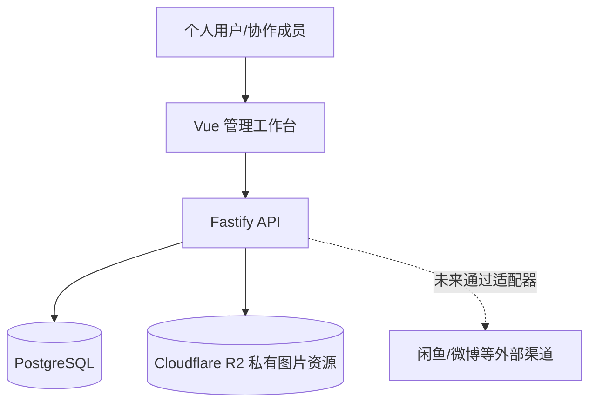
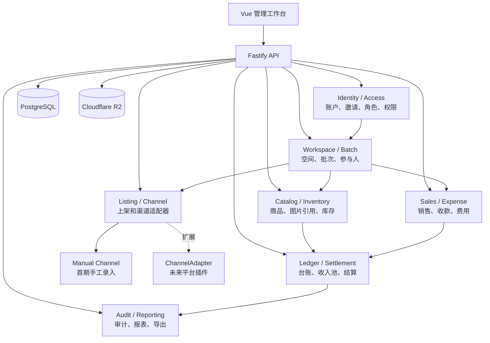

# ThunderLedger 总体架构

## 1. 架构结论

ThunderLedger 采用 Vue + Fastify + PostgreSQL + Cloudflare R2 的模块化单体。空间负责长期的数据边界，协作批次负责一次共同采购/售卖的参与人和账务边界。

首期不拆分微服务、不引入消息队列、不接管外部平台账号。外部渠道通过适配器接口预留扩展。

## 2. 系统上下文



## 3. 模块边界



### Identity / Access

负责账户、邀请注册、会话、角色和授权判断。所有业务模块只能通过统一的访问上下文读取当前用户、空间和批次范围。

### Workspace / Batch

空间是长期容器；批次是细粒度协作和财务边界。批次参与人决定可见范围，成员角色决定可执行操作。

### Catalog / Inventory

商品是可复用资料；库存批次绑定具体采购/协作批次。库存变化通过流水记录，不由页面直接覆盖数量。

### Listing / Channel

上架记录与渠道解耦。首期启用手工渠道，后续通过 `ChannelAdapter` 接入外部平台。

### Sales / Expense

记录成交事实、销售人、收款人和直接费用，不直接决定最终收益归属。

### Ledger / Settlement

将采购出资、商品成本、销售收入和费用转换为可解释的公共收入池和结算快照。锁定后只能追加调整。

### Audit / Reporting

审计记录与业务事实分离保存；报表和导出只能访问当前用户有权限的数据。

## 4. 核心数据关系

```text
User 1--N Workspace
Workspace 1--N Product
Workspace 1--N CollaborationBatch
CollaborationBatch 1--N BatchParticipant
CollaborationBatch 1--N InventoryLot
InventoryLot 1--N Listing
InventoryLot 1--N Sale
CollaborationBatch 1--N Contribution
CollaborationBatch 1--N CostAllocation
Sale 1--N Expense
CollaborationBatch 1--N Settlement
Product 1--N AssetReference
```

关键不变量：

- 出资合计等于采购总额。
- 成本分摊合计等于采购总额。
- 售出数量不得超过可售库存。
- 完整批次结算转账额合计为零。
- 锁定结算不可被普通更新覆盖。

## 5. 关键数据流

### 5.1 图片上传

```text
Web -> API presign -> 浏览器 PUT R2 -> API complete -> assets 元数据
```

R2 Bucket 保持私有；读取通过 API 生成短时签名 URL。密钥只通过环境变量或 Secret 注入。

### 5.2 销售入账

```text
选择库存批次 -> 记录成交价/销售人/收款人 -> 校验库存
-> 写入 Sale 和库存流水 -> 更新批次可售数量
```

销售款进入批次公共收入池；收款人只用于结算时抵扣已收款。

### 5.3 协作结算

```text
采购总额 + 出资 + 成本分摊 + 销售 + 费用
  -> 计算利润和参与人份额
  -> 抵扣各人已收款/已垫付/已出资
  -> 生成预览结算单
  -> 确认后锁定快照
```

## 6. 接口边界

业务 API 按领域分组，统一使用当前用户的授权上下文：

```text
/api/auth/*
/api/workspaces/*
/api/batches/*
/api/products/*
/api/inventory/*
/api/listings/*
/api/sales/*
/api/expenses/*
/api/settlements/*
/api/assets/*
/api/audit/*
```

### ChannelAdapter

```ts
interface ChannelAdapter {
  id: string;
  capabilities: string[];
  createListing(input: NormalizedListing): Promise<AdapterResult>;
  importSales(input: ImportCursor): Promise<NormalizedSale[]>;
  mapStatus(externalStatus: string): string;
}
```

首期仅实现 `manual`，外部适配器的授权配置、同步游标和幂等键不得进入核心台账模型。

## 7. 安全与演进约束

- 前端权限控制只用于体验，后端必须再次校验。
- 财务和权限操作写入审计日志。
- 删除采用软删除；结算和财务事实不物理覆盖。
- 金额使用 0.1 元精度的整数“角”存储，API 使用字符串。
- PostgreSQL 是业务事实来源；R2 只保存图片对象和元数据引用。
- 未来拆分服务时，以模块边界和 API 契约为依据，不改变账务事实模型。
